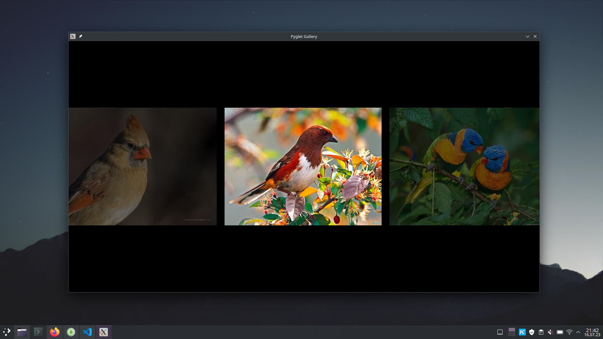
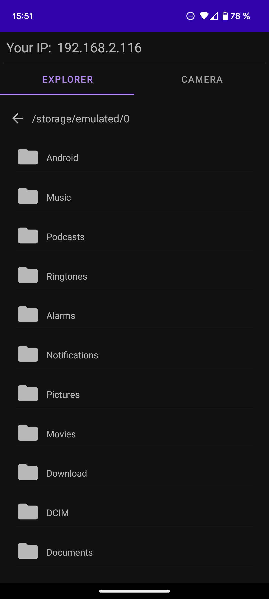
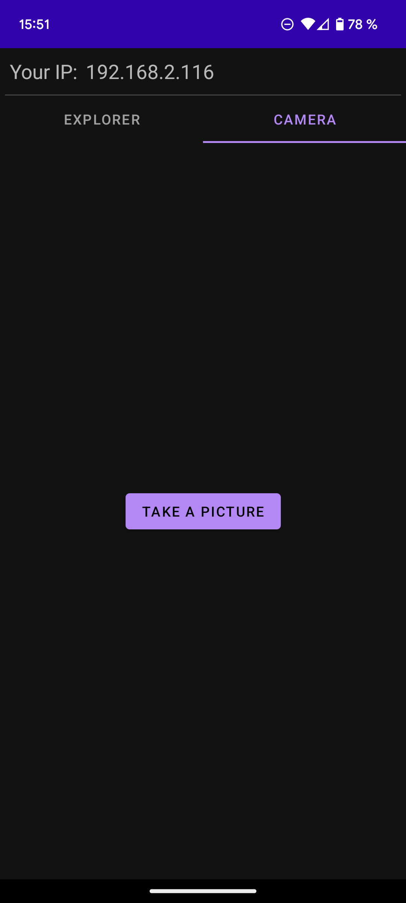
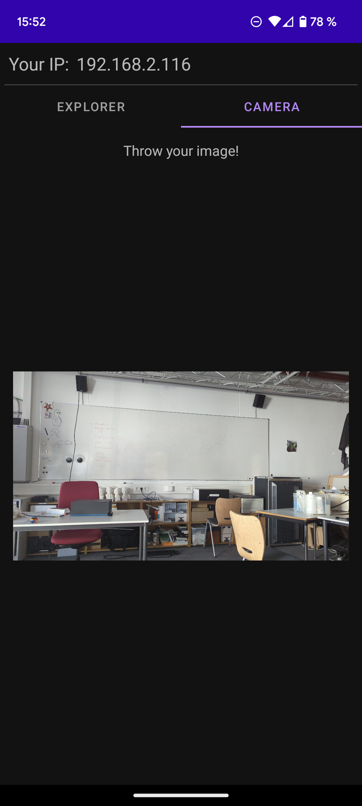

# Documentation

We decided to re-implement ["Natural throw and tilt interaction between mobile phones and distant displays"](https://dl.acm.org/doi/abs/10.1145/1520340.1520467?casa_token=tPt_nNSHzxoAAAAA%3AvBnONUcn68lt9nj3HLlBOtkJKcMi-a-HIHsYxd4WW2xYXDjClwjj9KEan7ISVKCcHQQqxwkJwEN6). Further description is provided below. At the end of this page, there is a short demo video of our application.

## Decision Process

We discussed several papers, for example "[The bubble cursor: enhancing target acquisition by dynamic resizing of the cursor's activation area](https://dl.acm.org/doi/10.1145/1054972.1055012)" which is an interesting and useful approach to improve object selection. As we made up our mind about it, we came to the conclusion that it could be implemented fast but it seems hard to extend with new features. Therefore, we found it not suitable for a group of three. We also had a look at "[Do That, There: An Interaction Technique for Addressing In-Air Gesture Systems](https://dl.acm.org/doi/pdf/10.1145/2858036.2858308?casa_token=jvp6qJ-JEssAAAAA:dalVRdxJTv-Et4qW6Dnm54OhmG3Wp89oem-OwNhVaZwAD9aNIdPhtL1bv49zAnh7ZCxyOg-L1Q-l98M)" and found it to be an interesting approach to help users find locations, in which their gestures can be accurately detected. However, we decided against it because it would have required too much hardware. In addition, we discussed several papers out of the journal club. But we came to the conclusion that most of them also require too much or too specific hardware. After looking over them, we discussed the paper ["Natural throw and tilt interaction between mobile phones and distant displays"](https://dl.acm.org/doi/abs/10.1145/1520340.1520467?casa_token=tPt_nNSHzxoAAAAA%3AvBnONUcn68lt9nj3HLlBOtkJKcMi-a-HIHsYxd4WW2xYXDjClwjj9KEan7ISVKCcHQQqxwkJwEN6). We found it was a reasonable interaction technique that can be used in many further, not yet mentioned, applications for example for switching between slides (e.g. powerpoint).

In the paper, the authors implemented different application scenarios. It was implemented to be used in Mambo, a large zoomable user interface which is designed for browsing music collections. In the applications scenario, users could tilt the phone left and right to pan through and up and down in order to handle zooming. A similar approach was made to navigate in 3D Maps. By tilting the mobile device, panning is performed in the corresponding direction. Additionally, they added a "switch" button since 3D map programs allow users to also zoom in and out ans switch the view (from bird's eye to street view). By pressing the switch button, users can switch between pan, zoom and tilt mode. Panning is performed by tilting the device in the corresponding direction. Zooming is performend by tilting the phone up and down. To change the perspective, you can simply tilt the phone left or right again in the perspective mode. The third and last application scenario is an image browser. The application allows the user to browse through an image gallery by tilting the phone. Additionally, they added a throw gesture in order to transfer images from their phone to the bigger screen.

For our assignment, we selected the image viewer application scenario because we believed it was the most suitable in terms of scope. Therefore, we excluded the music browser and the 3d map navigation. For the application, only a smartphone is required (no additional hardware) and the interaction with the gallery seems natural.
However, we modified how the gestures are classified. In the paper, it is described that tilt gestures are classified based on rotation using a simple threshold. Instead, we decided to use an LSTM approach because we assumed that the LSTM would recognize gestures more robustly, and we could directly apply what we learned from our course.

## Components and Implementation

### Gesture Recognition

We trained an LSTM model on four gestures: TILT_LEFT, TILT_RIGHT, THROW, NEUTRAL.

1. First, we generated a lot of accelerometer data with `gather-data.py` with M5Stacks and android smartphones using the DIPPID class. This app makes it easy to generate data: pressing button_1 starts a record, pressing button_1 again stops the record and dumps it in a csv file. This can be repeated for a specific gesture as long as needed. The CLI parameters are documented in the according script file. According to the paper, accelerometer data is sufficient to recognise the correct gestures.

2. Mid-project, we realised that the x-axis of M5Stacks and some Android Smartphones are inverted. So we decided to check all the git commits that included data from M5Stacks and multiplied all accelermeter x values by -1. (see `invert.py` in archive). We used the command `git diff --name-only f0040395abd9956eb30f8a95f4411987bfe24a48^ f0040395abd9956eb30f8a95f4411987bfe24a48 | grep -E '\.csv$' > f0040395abd9956eb30f8a95f4411987bfe24a48.txt` to get the according files from the commit. All the created files were merged into `all.txt` which can be found in archvie.

3. We trained a LSTM model that showed good results after 500 records. In total, we recorded 2608 gestures with M5Stacks and android smartphones. We also included a plot showing the loss and accuracy for each epoch along with a confusion matrix.

4. We saved the trained model to the folder lstm_model so that we can compile it when needed in `recogniser.py` that is referenced in `gallery_app.py`. We also saved the encoder settings so that we can savely translate the encoding back to the enum names.

5. `test_recogniser.py` (in archive) can be used to test the trained recogniser model with a M5Stack or an android smartphone.

### Tilted Desktop App - Image Viewer

#### Getting Started

1. run `python gallery_app.py -p [dippid port] -pi [smartphone IP] -pi [smartphone port] -f [path to image folder]`
   Command line parameters are optional and have default values. But for remote control, make sure the smartphone IP is correct.

#### Description

The desktop application consists of a pyglet window, which displays images of a given folder. You can use the arrow keys on the keyboard to scroll to this image gallery.

In combination with **DIPPID** and **Tilted** (described below), you can also use a mobile device as remote control here. The pyglet app handles different events then:

- TILT LEFT: the image viewer shows the previous displayed image.
- TILT RIGHT: the next picture is shown.
- THROW: an image chosen by **Tilted** mobile app is added and focused.

#### Implementation

For classifying performed gestures with the mobile device, the desktop app uses a pre-trained LSTM (described above). The prediction is based on accelerometer sonsor data which are sent via **DIPPID** from mobile device to PC. Incoming accelerometer data is stored in a deque. As soon as we have enough values, the program initiates a prediction. Based on the prediction, the pyglet app replaces the images or sends a GET-request to receive an image from **Tilted** mobile app.

### Tilted Mobile App - Image Selection

If you just want to use your smartphone as a remote control to browse through your image gallery, it is sufficient to install only the **DIPPID** app. But if you also want to transfer an image from your smartphone to a larger screen, you will additionally need the **Tilted** app.

#### Getting Started

1. download [Tilted](tilted.apk) and [DIPPID](https://github.com/PDA-UR/DIPPID-android) and install them on your mobile device
2. start **DIPPID**, enter your PC's IP and toggle send data so that it is active
3. start **Tilted**, make sure **DIPPID** is still running in the background
4. start `gallery_app.py` and pass the IP displayed in your **Tilted** app as command line parameter
5. use **Tilted** as described in the following

#### Description

The mobile app consists of two sections which can be switched by a tab menu. One section for selecting an image and another section for taking a new photo to add it to the current image gallery at the larger screen.

|                     explorer view                      |                    take-a-photo view                     |                   ready-to-throw view                    |
| :----------------------------------------------------: | :------------------------------------------------------: | :------------------------------------------------------: |
|  |  |  |

In the **explorer view**, you can chose an image out of your files. If you click its filename, it will be displayed in the **ready-to-throw view**. By performing a _throw_ gesture, the file will be transferred to and displayed at your other device.

When clicking the button in the **take-a-photo view**, the camera opens up and you can take a picture in landscape mode. Once you have done this, the newly captured image shows up in the **ready-to-throw view**. Now, you can transfer the photo with a _throwing_ gesture.

#### Implementation

We implemented the mobile app in Java. It offers a GUI to chose an image file out of a file explorer as well as the option to take a new photo.

Since we have **DIPPID**, we used the existing workflow for sending sensor data to the PC. For this reason, and because of the simpler use `python`, we recognize performed gestures on the PC, not on the mobile device. Therefore, the PC has to notify the mobile device when the user performs a _throwing_ gesture.

To this end, we implemented a HTTP server on the mobile device using [NanoHTTPD](https://github.com/NanoHttpd/nanohttpd) which receives GET-requests as soon as a _throw_ gesture is recognized. The smartphone responds with the currently displayed image within **Tilted** encoded as `base64`.

To establish a connection between mobile device and PC, the smartphone's IP is served as command line parameter to the image gallery. No worries, there is no need for the user to discover their smartphone's IP by themselves: It is displayed in **Tilted**.

# Demo

